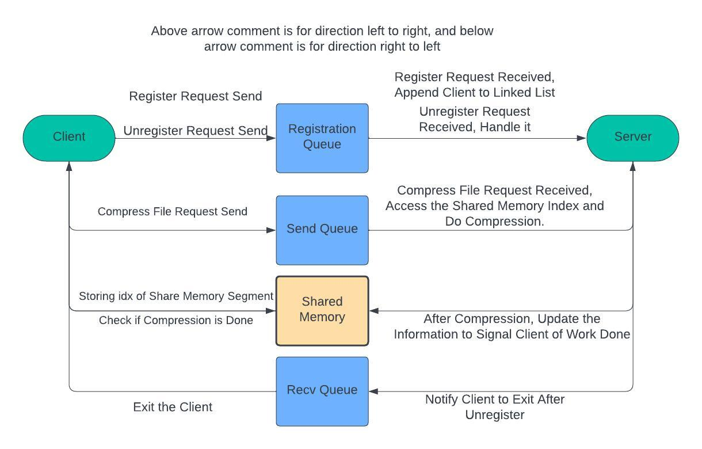
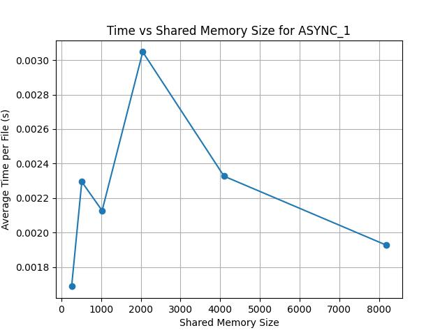
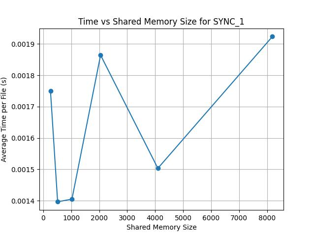
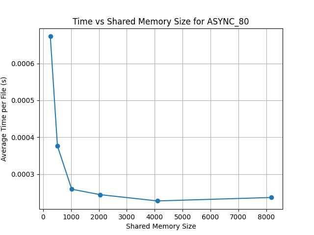
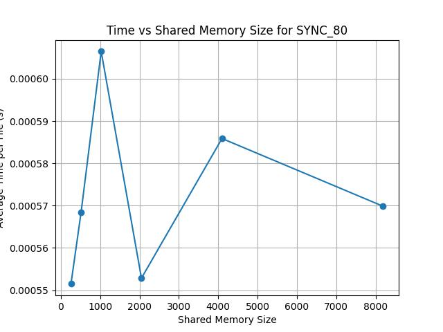
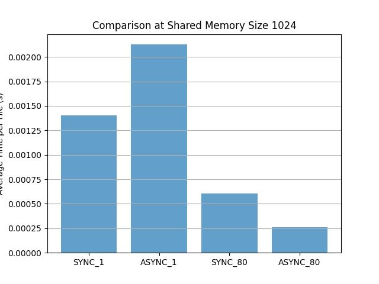

# Project 2 Report
### Author: Zebin Guo (Sole Contributor to this project)
### GTID: 904054219

## Readme of this project
Citation: In this implementation, I use GenAI tools for generating the cmakelist and makefile and code demo suggestion. But I did not use the code generated by GenAI tools. The code is all written by myself.
### The folder structure is as follows:

- /bin:
  - /input: The input files for testing, already exists in template.
  - /output: The output compression files.
  - /object: The compiled object files for execution
- /include
  - /snappy-c: The snappy-c library used for compression
  - /tinyfile: The header files in this implementation
- /obj: some intermediate files for cmake
- /src
  - /client: The client implementation
  - /server: The server implementation
- *.jpg: The figures for CST analysis and flowhart
- client_log.csv: The log file for CST analysis
- cmakeLists.txt and makefile: The cmake and makefile for the project
- plot_script.py: The script for generating the figures (Citation: This script is generated by GenAI tools)
- sample_command: The sample command for running the project (Read this file for running the project!!!)
- Other files are the original files from the template


## Overall Design
The flowchart is shown below:

- Registration Queue (Register/Unregister Requests):
  - The client sends a register or unregister request to the registration queue.
  - The server receives this request, and if it is a register request, the server appends the client to its internal linked list. For an unregister request, the server handles the removal of the client.
- Client to Send Queue (Compress File Request):
  - Once registered, the client sends a compress file request to the send queue. This request contains the necessary information to process the file compression.
- Server Handling Compress Request:
  - The server reads the compress file request from the send queue, accesses the shared memory, retrieves the shared memory index, and begins the compression process.
- Shared Memory Interaction:
  - After the compression is complete, the server updates the shared memory to signal the client that the work is done.
  - The client constantly checks the shared memory to see if the compression process is complete by verifying the updated index in the shared memory segment.
- Server to Receive Queue (Notification):
  - Once compression is complete, the server sends a notification back to the receive queue to inform the client that the process has been finished and it can proceed with the next steps, such as unregistering or exiting.
- Client Unregister and Exit:
  - After receiving the completion signal, the client sends an unregister request (if required) and exits the process, cleaning up resources.
  
## SYNC/ASYNC Implementation
### Single File Handling:
- SYNC: The client sends a compression request through the send_q, waits for the server to complete the task, and checks the shared memory for completion using a loop until the server sets the is_done flag.
- ASYNC: The client sends a compression request and waits for the server to signal task completion. In fact, for single file handling, the ASYNC implementation is not significantly different from the SYNC implementation.
### File List Handling:
- SYNC: The client handles each file sequentially, sending the compression request and waiting for completion before moving to the next file.
- ASYNC: The client sends compression requests for all files simultaneously, creating threads to wait for the completion of each file's compression task. The main thread waits for all threads to finish using pthread_join.

# CST Analysis
To analyze the performance, I create five figures. The first four figures measure the relationship of average execution time with the number shared memory size, and the last figure measures the relationship of average execution time for four different file and synchronization methods. As in mt implementation, each shared memory entry uses 248 bytes, so the shared memory size starts from 256 to 8192. CST logging is enabled for each request, stored in client_log.csv file. We do not analyze the effect of the number of shared memory, as it only affacts the number of client it can serve simultaneously, which is tested correctly in the author's machine.

The results are shown below:

Title explanation:
- SYNC_1: Synchronous single file handling
- SYNC_80: Synchronous file list handling with 80 files
- ASYNC_1: Asynchronous single file handling
- ASYNC_80: Asynchronous file list handling with 80 files
1. 
2. 
3. 
4. 
5. 
Exploration from the figures:

- The figure 1,2,4 seems to not tell explicit rules to follow. However, it should be the case. From explanation above, the ASYNC for single file handling is almost the same as SYNC for single file handling. When the shared memory size expands, SYNC operation does not benefit from it, as the shared memory index will be updated every time a request is handled. Further, the flunctuation in the figure 1,2,4 is only due to the fluctuation of the system. Further, the scale of the y-axis remains almost the same for the three figures. Still, it's interesting to see that the average execution time for SYNC_80 is a lot faster than ASYNC_1 and SYNC_1. This can mainly attribute to smaller overhead in handling multiple files in a single request and efficient cache utilization, as all files requested are the same.
- The figure 3 reveals that the average execution time for ASYNC_80 is significantly faster than SYNC_80. This is because the ASYNC operation can handle multiple files simultaneously, which reduces the overall execution time. The scale of the y-axis is also significantly smaller than the other figures, indicating that the ASYNC operation is more efficient in handling multiple files. Further, with the increase of shared memory size, the average execution time decreases, which is expected as the shared memory size increases, the server can handle more requests simultaneously. However, when the shared memory size is too large, the average execution time increases, which is due to the overhead of handling a large shared memory segment, and the bottleneck of the system is not on the shared memory size.

# QoS Not Implemented due to Solo Contribution
# Sample Application: 
In Server.c and Client.c, an launcher is implemented respectively. To run the data in the figures (and also how to make files), please follow the instructions in ```sample_command``` file.