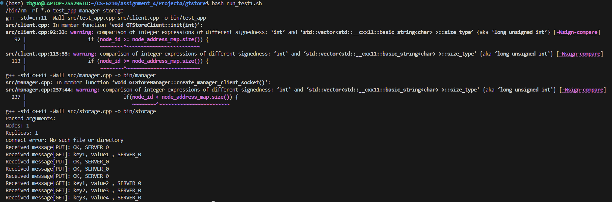
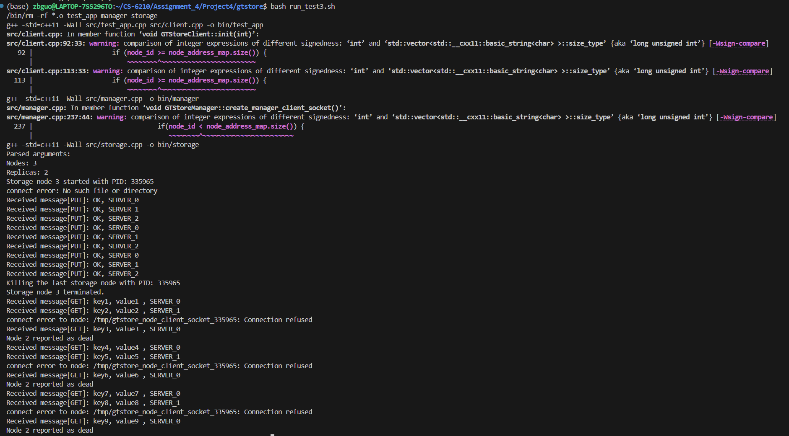
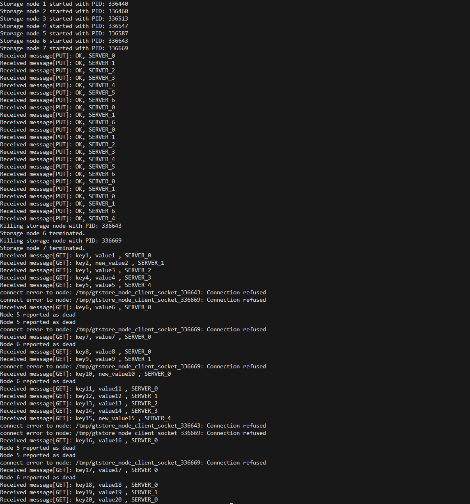
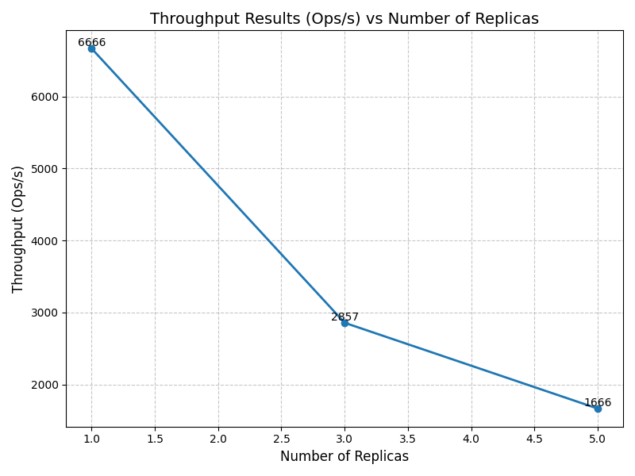
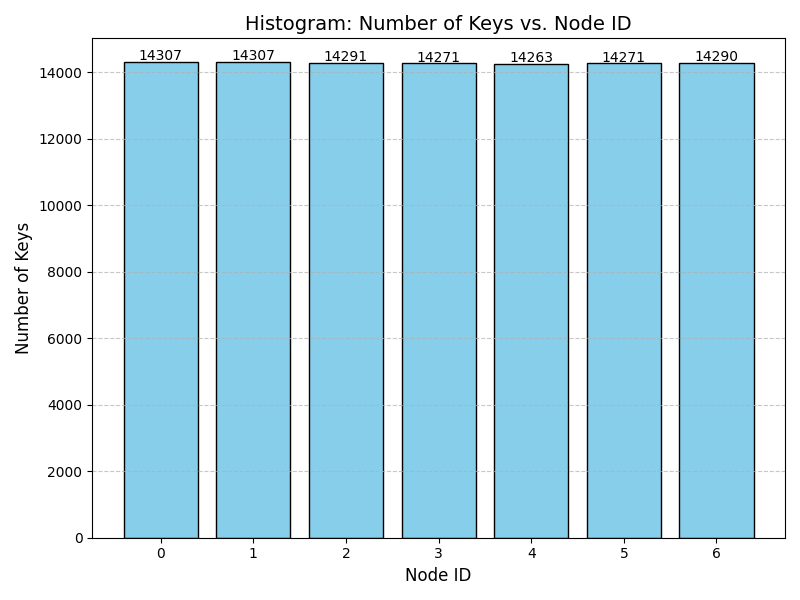

# CS 6210 Assignment 4 Report 
## Author: Zebin Guo
## GTID: 904054219

## System Components
1. GTStore Centralized Manager: our manager is responsible for contacting storage nodes and client upon initialization. It also accepts connection with client when the client experiences node failure (socket connection fails).
   1. On initialization of client, the manager will tell the client of hashing function used to find target storage node to store or retrieve data.
   2. The replication is done by consecutive storage nodes in the ring.
2. GTStore storage nodes: our storage nodes are responsible for storing key-value pairs using unordered_map, which is efficient for key-value pair storage and retrieval. They also have node-to-node communication to send data to target n-1 storage nodes for replication, where n is the number of replicas, the replica sending is only and automatically done when the client sends a put request. The information of target n-1 storage nodes is retrieved from the manager at initialization stage.
3. The driver application is a single process enabling the client to perform get and set operations on the key-value store. The client can also initialize and finalize the session with the manager.
4. Client library:
   1. init: initialize the client by connecting with manager, retrieving information such as hash function, node addresses, and number of replicas.
   2. put: first run a hash function to find the target storage node, then send the data to the target node for replication.
   3. get: run a hash function to find the target storage node, then send the data to the target node for retrieval.
   4. finalize: do nothing, as we do not require any cleanup operation.

## Design Principles
1. Data partitioning: again, we self-design a hash function to partition incoming data across data nodes. The hash function is a simple modulo operation on the key to find the target storage node. Everytime the client sends a put or get request, the client will first run the hash function to find the target storage node to connect with.
2. Data replication: we maintain K number of data replicas for any stored object. The replication is done by consecutive storage nodes in the ring. The client will send the data to the target storage node, and the target storage node will send the data to the next n-1 storage nodes in the ring immediately (immediate consistency). The client will only send data to the target storage node, and the target storage node will automatically send the data to the next n-1 storage nodes in the ring. When the primary storage node fails, the client will notify the manager. As the client retrieves all node information from the manager, the client can easily find the next storage node to send the data to. Disclaimer: here I assume the client should store multiple key-value pairs in the same storage node, so the client should have the knowledge of all the storage node address and the number of replicas.
3. Data Consistency: As  suggested, we use immediate replication, which is the recommended way to implement the behavior expected in the test cases. Inserted objects get stored on K (replication parameter) nodes within a bounded time, and read operations are guaranteed to receive the latest version of the requested object.

## Client Driver Application: 
I modify the test_app.cpp in the template to implement the client driver application. The client driver application can connect to the service, and perform a single GET or PUT operation every time, based on config.

## The design tradeoffs: 
I used a node2node communication technique to deal with replication. The rationale is that at initialization stage, every node is aware of the addresses of next n-1 storage nodes in the ring. Everytime it receives a PUT request from the client, it will send the data to the next n-1 storage nodes in the ring. Also, after handling the client message, it will check whether the replicated data from other nodes (current node is responsible for storing the replicated data of previous nodes) is received. By this, we can prevent the overhead of communication between storage nodes and manager, and also prevent the overhead of sending data to all storage nodes in the ring. Please note that unlike normal immediate replication, the client in my design does not wait for replication process, as I migrate the duty of replication to storage node itself. Hence the workload and latency of client-node communication is reduced as well. The tradeoff is that the client should have the knowledge of all the storage node address and the number of replicas, and the socket connection between storage nodes is not guaranteed to be successful.

## Implementation Issues: 
Current test cases for failure scenerios are targeting for process-kill manner, after the previous instruction is completed. In my implementaion, the replication data handling is after client-node communication, so there are chances that the replication will fail, even after the client finds the request is successful.

## Test Cases:

In root directory, there should be four script file, naming from run_test1.sh to run_test4.sh. please run ```bash run_test(1-4).sh``` to run the test cases. The test cases corresponds with the test cases in the instruction. The screenshots of the test cases are as follows, and can also be found in the screenshots folder.

1. test1: 
2. test2: 
3. test3: 
4. test4: 
Please node that for test4, key2, key10 and key 15 are updated, and the new_value(id) is the latest version of the key-value pair.

## Performance Analysis:
1. The throughput graph is as follows (can also be found in the performance folder, please note that I only uses 20k instead of 200k ops for testing, as the 200k version is too slow): 
   1. This behavior is expected, as the replication process is done by the storage nodes, which will introduce a lot of overheads. The throughput is reduced as the number of replicas increases.
2. The node distribution graph is as follows (can also be found in the performance folder): 
   1. This behavior is expected, as the hash function is a simple modulo operation, and the key is uniformly generated. The distribution of keys is almost uniform
3. The tests can be verified by running the test scripts (test_throughput.sh and test_load_balance.sh) in the root directory. The test scripts are named from run_test1.sh to run_test4.sh. The test scripts will run the test cases as described in the test report.